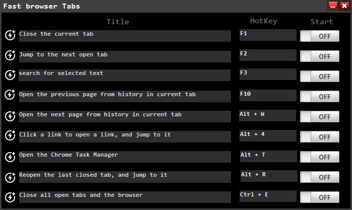

# fast-browser-tabs

## allow you to operate browser tabs with one click, saving you time and improving efficiency
Having hotkeys as a means to improve efficiency and even comfort in use, can be a great asset to have, especially when wanting to squeeze every possible bit of ergonomics from your software. Internet browsers and their most commonly used features are subject to such potential implications. In an attempt to provide aid to such requirements, the app will offer you ways to assign hotkeys to some of the most commonly used browser operations, and therefore achieve the preferred level of efficiency in use.

Compact and lightweight, thanks to the portable deployment, coupled with easy toggling for the hotkeys
The application comes deployed as a portable package, which means that if you’re accustomed to working on the fly, you will be able to take the app, together with your favorite browser, on your preferred storage medium.

Setting and toggling the hotkeys for the different operations, is even easier, thanks to the simple selector, which will allow you not only to switch them on and off, but as well as easily preview their state, which can be useful in case you’re using them for other apps.

Access an internal library of pre-defined hotkey operations, in order to select the preferred ones for your requirements
Besides the on-screen, provided hotkeys, the app also comes with the possibility to switch them up and select different ones for the different positions in the main toggling window of the main interface.

There is a list of pre-defined actions that can be selected, which, in my opinion, manages to cover the requirements pertaining to some of the most commonly used tasks and operations you would perform while surfing the Internet on your browser.

An elegant solution for improving browser function, with the use of multiple hotkeys for your preferred operations
This application manages to provide a very intuitive solution for making your Internet browser interaction more efficient, by allowing you to assign hotkeys to your preferred operations and tasks.
